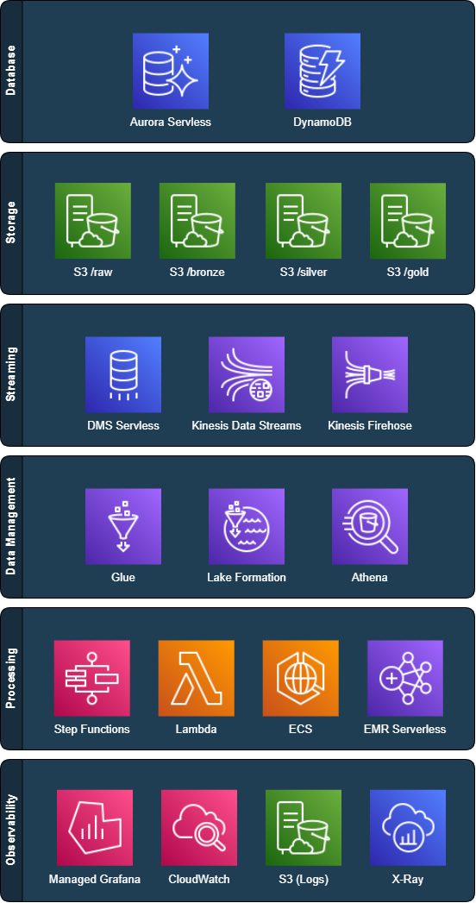
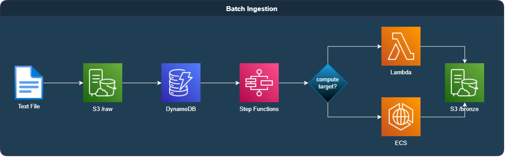
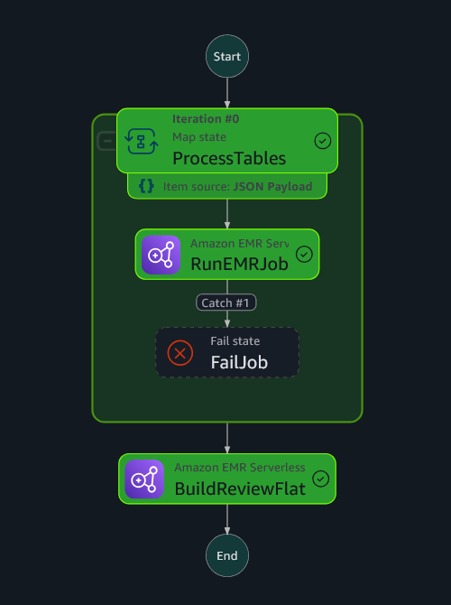
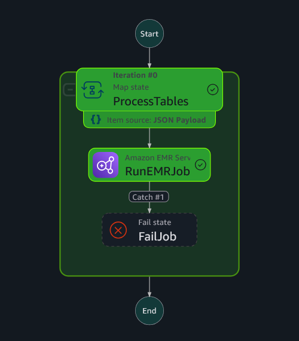

# Visão Geral da Arquitetura

O projeto Data Master implementa uma arquitetura de dados moderna e serverless, projetada para suportar a ingestão de dados em tempo real e em lote, processamento em múltiplas camadas (raw, bronze, silver, gold), além de catálogo, governança, consumo analítico e observabilidade. Esta documentação descreve em detalhes cada componente da arquitetura, seus fluxos e respectivas responsabilidades.

> Para detalhes técnicos sobre a composição das stacks CloudFormation e seus respectivos recursos, consulte a seção [Componentização da Arquitetura por Stacks](stacks.md).

---

## Arquitetura Geral

A arquitetura é composta por diversas stacks CloudFormation, organizadas por camadas funcionais. O diagrama acima apresenta os principais serviços envolvidos, agrupados por suas responsabilidades — como ingestão, armazenamento, processamento, catalogação, governança e consumo analítico.

Essa visão permite compreender de forma clara a estrutura geral do ambiente, antes de explorar os fluxos de dados e interações detalhadas em cada etapa do pipeline.

--- 

## Ingestão de Dados

### 1. Ingestão via Streaming

O fluxo de **streaming ingestion** tem início no **Aurora Serverless**, configurado com uma instância do **AWS DMS** para captura de alterações via **Change Data Capture (CDC)**. Esse mecanismo garante que operações de *insert*, *update* e *delete* executadas nas tabelas monitoradas sejam refletidas no pipeline com latência mínima.

Os eventos gerados pelo DMS são enviados para o **Kinesis Data Streams**, que atua como intermediário para o **Kinesis Firehose**. O Firehose, por sua vez, está configurado com uma função **Lambda transformadora**. Essa função valida a estrutura dos dados, extrai os metadados do payload (como o nome da tabela e o tipo de operação), adiciona campos complementares no payload final (como `operation`) e define dinamicamente a partição de destino via `PartitionKeys`, com base no `table_name`. Os dados transformados são então gravados pelo próprio Firehose no bucket `dm-stage`, sob o caminho `raw/<nome_da_tabela>/`, no formato `.gz`.

A criação de cada novo arquivo `.gz` aciona automaticamente um evento de notificação do S3. Esse evento resulta na gravação de um **registro de controle no DynamoDB**, que mantém metadados como o nome do arquivo, timestamp de criação, quantidade de tentativas, status de execução e outras informações úteis para o monitoramento e reprocessamento.

O controle armazenado no DynamoDB aciona uma **Step Function**, que determina o alvo de processamento (Lambda ou ECS) com base no volume de dados estimado. Por convenção, arquivos com até **100 mil registros** são processados por **Lambda**; acima disso, são delegados a um contêiner no **ECS**, garantindo escalabilidade e performance.

O processamento é executado em **Go puro**, com uso intensivo de concorrência para alto desempenho. Os dados são lidos em stream, descompactados, convertidos de JSON ou CSV para **Parquet**, e gravados na camada **bronze** do data lake, em estrutura de pastas compatível com Hive. Essa organização permite consultas eficientes e evolução incremental do pipeline.

---

### 2. Ingestão via Batch

O fluxo de **batch ingestion** é utilizado para processar tabelas que apresentam alto volume de inserções, mas que **não exigem ingestão em tempo real**. É o caso, por exemplo, da tabela `review`, que pode ser extraída periodicamente a partir da base relacional, armazenada como arquivo `.gz` e enviada diretamente ao bucket `dm-stage`.

Uma vez armazenado no S3, o arquivo dispara o mesmo mecanismo de notificação utilizado no pipeline de streaming, registrando um controle no **DynamoDB**. A partir desse ponto, **todo o fluxo de processamento é reaproveitado**: a **Step Function** é acionada, o destino de execução (Lambda ou ECS) é definido conforme o volume do arquivo, e os dados são processados por componentes escritos em **Go puro**, convertidos para **Parquet** e gravados na camada **bronze** do data lake.

Essa unificação entre os pipelines de streaming e batch garante consistência, simplicidade e baixo custo operacional, mesmo em cenários com características de ingestão bastante distintas.

---

## Processamento Bronze → Silver

O pipeline de transformação da camada **bronze para silver** é acionado por um evento programado no **EventBridge**, com frequência configurável (por exemplo, diariamente). Esse evento dispara uma **Step Function**, representada na imagem acima, que paraleliza o processamento das tabelas `brewery`, `beer`, `profile` e `review` por meio de uma estrutura de `Map`.

Cada uma dessas tabelas é processada por um **Job PySpark em EMR Serverless**, com suporte ao **Glue Catalog**. Os dados da camada bronze são lidos no formato **Parquet**, e enriquecidos com os campos `created_at` e `updated_at`, derivados do timestamp de processamento registrado no controle do DynamoDB.

Durante o processamento, todas as operações de *insert*, *update* e *delete* registradas na camada bronze são **identificadas e tratadas de forma explícita**. A implementação atual aplica inserções via `append` e realiza *upserts* e *soft deletes* utilizando comandos `MERGE` do Apache Iceberg. Esse comportamento garante consistência dos dados na camada silver, mantendo um histórico confiável e alinhado com os princípios de governança e rastreabilidade definidos no projeto.

As tabelas geradas são gravadas no formato **Iceberg** e particionadas por `review_year` e `review_month`, otimizadas para leitura via motores analíticos como Athena e compatíveis com consultas incrementais.

Ao final da execução paralela, a Step Function prossegue para a etapa `BuildReviewFlat`, que gera uma visão agregada unificada com base nas tabelas processadas anteriormente — consolidando o ciclo completo da camada silver.

---

## Processamento Silver → Gold

A transformação da camada **silver para gold** segue o mesmo padrão de orquestração da etapa anterior. Um evento agendado via **EventBridge (cron)** aciona uma **Step Function**, que itera sobre as tabelas definidas para agregação, executando um **Job PySpark em EMR Serverless** para cada uma delas. A estrutura de `Map` permite o processamento paralelo, com tratamento de falhas via estado `Catch`.

O objetivo desta etapa é gerar **tabelas otimizadas para consumo analítico**, a partir de dados refinados e já padronizados na camada silver. São aplicadas agregações, ordenações e seleções que facilitam visualizações em dashboards e exploração por ferramentas como Grafana ou Athena.

Exemplos de tabelas geradas nesta etapa:

* `top_beers_by_rating`: média das notas por cerveja
* `top_breweries_by_rating`: melhores cervejarias com base nas avaliações
* `top_drinkers`: usuários mais ativos da base
* `top_styles_by_popularity`: estilos com maior número de reviews
* `state_by_review_volume`: estados com maior volume de avaliações

As tabelas gold também utilizam o formato **Iceberg** e seguem particionamento por `review_year` e `review_month`, garantindo alta performance em consultas com filtro temporal.

---

## Consumo Analítico

As tabelas da camada gold são acessíveis via Athena, com catálogo mantido no Glue Catalog. Consultas ad hoc podem ser realizadas diretamente, com performance garantida pelo particionamento e formato Iceberg. Todas as tabelas da camada gold são compatíveis com ferramentas como Tableau, Power BI e Grafana.

---

## Governança e Segurança de Dados

A governança de dados no projeto foi estruturada com foco em segurança, rastreabilidade e escalabilidade. As principais iniciativas já implementadas incluem:

### Lake Formation habilitado

O Lake Formation foi habilitado no ambiente para centralizar o controle de acesso aos dados e aplicar políticas de segurança de forma granular e auditável. Com isso, o projeto já suporta:

* Definição de permissões granulares por **banco, tabela, coluna ou linha**
* Integração com **IAM Identity Center (SSO)** ou roles específicas por consumidor
* Auditoria de acessos com integração nativa ao **AWS CloudTrail**

### Criptografia em repouso com KMS

O bucket `dm-stage`, onde os dados são inicialmente armazenados na camada `raw`, possui **criptografia SSE-KMS ativada**. A chave KMS é gerenciada pelo projeto e tem permissões restritas às roles que participam do pipeline.

* Os dados são automaticamente **criptografados em repouso** no S3
* Acesso à chave é concedido apenas a roles autorizadas
* A chave é rotacionada automaticamente e auditável via **CloudTrail**

### Detecção automática de PII com AWS Comprehend

Durante a ingestão dos dados, o **AWS Comprehend** é utilizado para analisar dinamicamente amostras dos arquivos e identificar campos com informações sensíveis (PII). Quando detectados, esses campos têm o mascaramento aplicado automaticamente, sem necessidade de configuração manual. Esse mecanismo permite proteger dados pessoais de forma automatizada e adaptável.

* Campos com alto score de PII são **mascarados automaticamente** durante o processo de ingestão
* Isso evita exposição acidental de dados sensíveis mesmo nas camadas internas do lake

### Usuário demo com acesso restrito

Foi criado um **usuário IAM de demonstração** com acesso **exclusivo à camada gold** (Glue e S3), permitindo validar na prática os controles aplicados. Tentativas de acessar outras camadas como bronze ou silver resultam em erro de permissão.

---

## DataViz e Observabilidade com Grafana AWS Managed Workspace

A etapa de **DataViz e Observabilidade** integra o pilar analítico e o monitoramento operacional da arquitetura, utilizando o **Grafana AWS Managed Workspace** como camada de visualização central. Essa solução foi escolhida por oferecer integração nativa com **Athena**, **CloudWatch** e **métricas de billing da AWS**, viabilizando uma visão completa dos dados, operações e custos do lake house.

### Arquitetura Geral

A stack `dm-observability` provisiona automaticamente o workspace do Grafana e configura os principais *datasources* (Athena e CloudWatch). A criação das dashboards é feita via CLI, utilizando arquivos versionados no repositório do projeto.

O fluxo de dados e visualizações segue três eixos principais:

1. **Dashboards Analíticos**
   Consomem as tabelas Iceberg da camada **gold**, extraídas via **Athena**. Representam a camada de insights de negócio, incluindo rankings, mapas, métricas agregadas e tendências.

2. **Dashboards Operacionais**
   Baseados em métricas do **CloudWatch**, monitoram o estado e desempenho dos componentes do pipeline (funções Lambda, Step Functions, EMR Serverless). São fundamentais para observabilidade contínua e investigação de falhas.

3. **Dashboards Financeiros**
   Utilizam o **Cost and Usage Report (CUR)** exportado em formato **Parquet**, consultado via **Athena**, permitindo visualizar o custo por serviço, componente e período. Esse fluxo requer configuração manual inicial, mas se integra ao pipeline de forma contínua após ativação.

### Considerações Arquiteturais

* A **workspace do Grafana** é criada via CloudFormation, mas **a autenticação via IAM Identity Center (SSO)** e a **instalação do plugin Amazon Athena** exigem etapas manuais no console da AWS, devido a restrições da plataforma.

* A criação dos *datasources* e dashboards é **automatizada via CLI**, permitindo reprodutibilidade e versionamento da camada de visualização.

* O uso de **partições `review_year` e `review_month` nas tabelas gold** permite que os dashboards analíticos se beneficiem de **partition pruning** no Athena, otimizando consultas e reduzindo custos.

* A visualização de **métricas operacionais** segue um modelo desacoplado, em que cada componente (ETLs, pipelines, jobs) envia métricas individualmente ao CloudWatch. Isso viabiliza um painel consolidado sem dependência de agregadores externos.

* A integração com o **Cost and Usage Report (CUR)** representa um ponto de maior manualidade, mas é crucial para o monitoramento financeiro do ambiente — permitindo que decisões arquiteturais sejam guiadas por custo/benefício observável.

---

Este documento oferece uma visão completa da arquitetura do Data Master. Novos componentes e melhorias futuras podem ser integrados de forma incremental, aproveitando a base serverless, modular e governada já estabelecida.

---

[Voltar para a página inicial](../README.md#documentação) | [Próximo: Componentização da Arquitetura por Stacks](stacks.md)