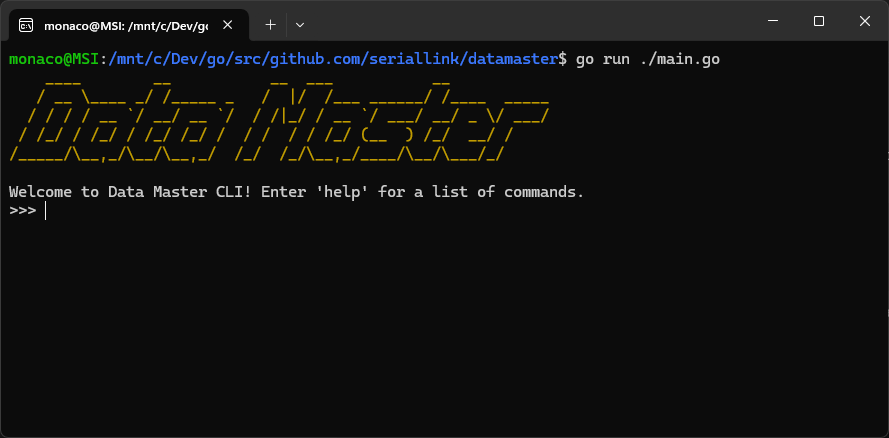

# Data Master CLI

O **Data Master CLI** é o ponto de entrada para toda a experiência deste projeto. Em vez de depender de interfaces gráficas ou scripts manuais, **todo o fluxo é guiado por uma interface de linha de comando interativa**, projetada para ser simples, clara e totalmente automatizada.

> A proposta é oferecer uma jornada estruturada e realista, simulando o trabalho de um engenheiro de dados em um ambiente moderno baseado em nuvem.

### Por que uma CLI?

* **Reprodutibilidade**: evita passos manuais e garante consistência entre execuções.
* **Automação total**: provisionamento, autenticação, deploy e processamento — tudo controlado por comandos.
* **Foco na experiência técnica**: ideal para simulações hands-on e uso real por engenheiros.

---

## Requisitos

Antes de começar, você precisa ter o seguinte ambiente configurado:

### 1. [Go 1.24+](https://go.dev/doc/install)

O CLI é escrito em Go e requer a versão 1.24 ou superior.

* Instruções de instalação: [go.dev/doc/install](https://go.dev/doc/install)
* Verifique a versão com:

```bash
go version
```

---

### 2. [Git](https://git-scm.com/downloads)

Utilizado para clonar o repositório e interagir com o projeto localmente.

* Baixe o Git: [git-scm.com/downloads](https://git-scm.com/downloads)
* Verifique a instalação com:

```bash
git --version
```

---

### 3. [Docker](https://www.docker.com/products/docker-desktop)

O CLI depende do Docker para carregar, taguear e publicar imagens em repositórios ECR. Certifique-se de que o Docker esteja instalado e rodando.

* Baixe o Docker Desktop: [docker.com/products/docker-desktop](https://www.docker.com/products/docker-desktop)
* Verifique a instalação com:

```bash
docker version
```

---

### 4. Conta na [AWS](https://aws.amazon.com/)

Você precisa de uma conta ativa na AWS. Caso ainda não tenha:

* Crie uma conta gratuita: [portal.aws.amazon.com](https://portal.aws.amazon.com/billing/signup)

---

### 5. Usuário com permissão **AdministratorAccess**

Crie um usuário IAM com permissões administrativas completas para executar todo o provisionamento via CLI.

* Guia para criar um usuário com `AdministratorAccess`:
  [Criar usuário IAM com permissão administrativa](https://docs.aws.amazon.com/pt_br/IAM/latest/UserGuide/id_roles_create_for-service.html)

> Durante a autenticação no CLI, você poderá usar tanto **AWS Profile** quanto **Access Key / Secret Key** desse usuário.

---

## Instalação do CLI

Com os requisitos atendidos, siga os passos abaixo para instalar o CLI localmente:

### 1. Clone o repositório

```bash
git clone https://github.com/seriallink/datamaster.git
cd datamaster
```

---

### 2. Compile e instale o CLI

Execute o comando abaixo para compilar o projeto e instalar o binário:

```bash
go install ./...
```

Esse comando compila o CLI e o instala no diretório padrão de binários do Go:

```
$GOPATH/bin
```

> Por padrão, o Go instala os binários em `~/go/bin` no Linux/macOS, e em `%USERPROFILE%\go\bin` no Windows.

---

### 3. Adicione o Go binário ao seu `PATH`

#### Linux/macOS:

Se ainda não estiver no `PATH`, adicione o diretório ao seu shell (`.bashrc`, `.zshrc`, etc.):

```bash
export PATH="$HOME/go/bin:$PATH"
```

E para tornar isso permanente:

```bash
echo 'export PATH="$HOME/go/bin:$PATH"' >> ~/.bashrc
```

Substitua `.bashrc` por `.zshrc` se estiver usando Zsh.

---

#### Windows:

O diretório geralmente é:

```
C:\Users\<SeuUsuário>\go\bin
```

Para adicioná-lo ao `PATH`:

1. Abra o **Menu Iniciar** e busque por `variáveis de ambiente`.
2. Clique em **Editar variáveis de ambiente do sistema**.
3. Clique em **Variáveis de Ambiente...**.
4. Em **Variáveis do usuário**, selecione `Path` e clique em **Editar**.
5. Adicione o caminho: `C:\Users\<SeuUsuário>\go\bin`
6. Clique em **OK** em todas as janelas.

> Após isso, reinicie o terminal (PowerShell, CMD ou Git Bash) para que a mudança tenha efeito.

---

### 4. Verifique se o CLI está funcionando

Abra um terminal e execute:

```bash
datamaster
```

---

### 5. Alternativa: execução direta com `go run`

Se preferir, você também pode executar o CLI diretamente a partir do diretório do projeto, sem precisar instalar o binário no `PATH`:

```bash
go run ./main.go
```

--- 

Se tudo estiver certo, você verá a interface interativa do Data Master CLI.



---

[Voltar para a página inicial](../README.md)