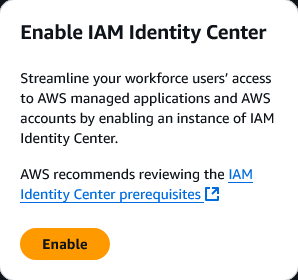
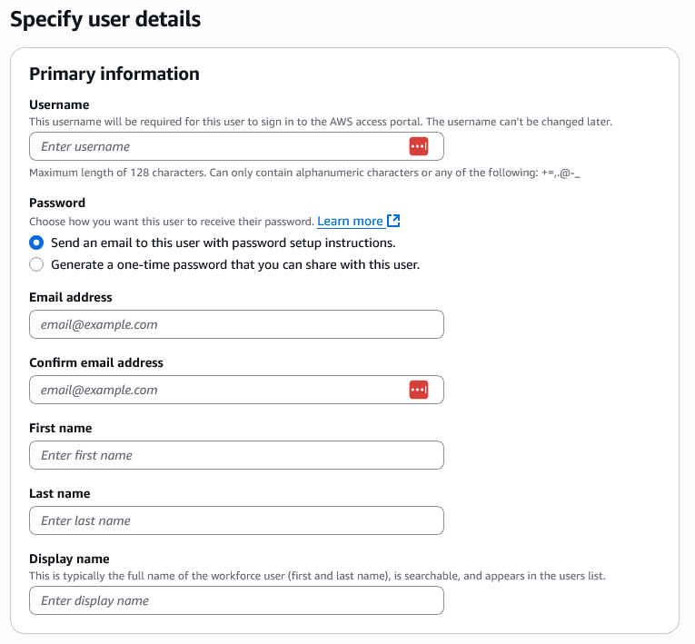
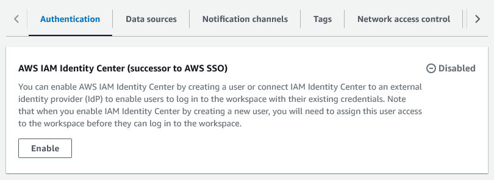
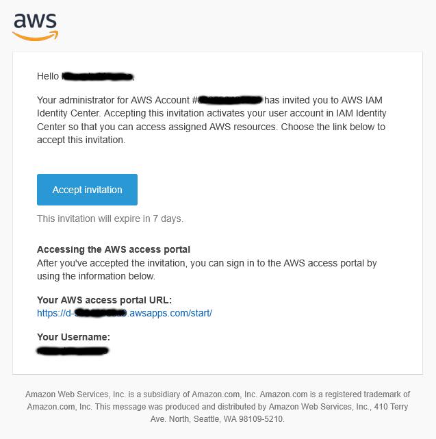

# Grafana Authentication Setup (AWS IAM Identity Center / SSO)

Este documento descreve os passos necessários para habilitar o login via AWS IAM Identity Center (SSO) no AWS Managed Grafana para o projeto Data Master.

---

## Pré-requisitos

- AWS Managed Grafana Workspace já criado
- IAM Identity Center habilitado na conta 
- Usuário com permissões administrativas para configurar SSO

---

## Etapas para configuração do SSO (IAM Identity Center)

### 1. Acessar o IAM Identity Center

Acesse a console do IAM Identity Center na AWS e verifique se sua instância está ativa e a região correta está selecionada.



---

### 2. Criar um novo usuário

- Menu lateral → **Users** → **Add user**
- Preencha os dados com as seguintes informações conforme imagem abaixo



> **Importante:** O e-mail deve ser válido e acessível, pois será usado para login no Grafana.

---

### 3. (Opcional) Criar um grupo

- Menu lateral → **Groups** → **Create group**
- Nome do grupo: `grafana-admins`
- Adicione o usuário criado ao grupo

---

### 4. Habilitar autenticação por IAM Identity Center (SSO)

* Acesse o console do Grafana: [https://console.aws.amazon.com/grafana/](https://console.aws.amazon.com/grafana/)
* Entre no workspace `dm-grafana-workspace`
* Navegue até a aba **Authentication**
* Na seção **AWS IAM Identity Center (successor to AWS SSO)**, clique em **Enable**



---

### 5. Atribuir usuário ou grupo ao workspace

Após habilitar o IAM Identity Center, você verá o status **Pending user input**. Agora é necessário **atribuir os usuários criados** ao workspace do Grafana.

* Ainda na aba **Authentication**, clique em **Assign new user or group**
* Selecione o usuário ou grupo criado nos passos anteriores (ex: `grafana-admins` ou o usuário individual)
* Clique em **Assign users and groups**

> Enquanto nenhum usuário for atribuído, o workspace ficará inacessível. A mensagem de alerta vermelha indicará isso até que a ação seja concluída.

---

#### 6. Promover usuário para Admin

Assim que o usuário for adicionado, o **User type padrão será `Viewer`**.

Para conceder permissões administrativas:

1. Localize o usuário recém-adicionado na lista
2. Marque o checkbox ao lado do nome
3. No menu suspenso **Action**, selecione **Make admin**

> Isso garante acesso completo à criação de dashboards, datasources e configurações administrativas no Grafana.

---

### 7. Aceitar o convite enviado por e-mail

Após atribuir o usuário ao IAM Identity Center e ao workspace do Grafana, o usuário receberá um **e-mail automático de convite** da AWS para ativar sua conta SSO.

* Abra o e-mail com o assunto **"You’ve been invited to AWS IAM Identity Center"**
* Clique no botão **Accept invitation**
* O usuário será redirecionado para uma tela onde deverá **definir uma senha para sua conta IAM Identity Center**
* Após criar a senha, a conta estará ativada e pronta para login



> O link expira em 7 dias. Caso o convite expire, será necessário remover e recriar o usuário no IAM Identity Center.

---

#### 8. Acessando o portal do Grafana

No mesmo e-mail, está disponível a URL do **AWS access portal**, como por exemplo:

```
https://d-xxxxxxxxxx.awsapps.com/start/
```

Após o login, o usuário verá um ícone do Grafana no painel de aplicações disponíveis.

**Alternativamente**, o acesso ao workspace também pode ser feito pelo Console da AWS:

1. Acesse o serviço **Amazon Managed Grafana**
2. Menu lateral: **All workspaces**
3. Clique no link da coluna **Grafana workspace URL** correspondente ao workspace `dm-grafana-workspace`
