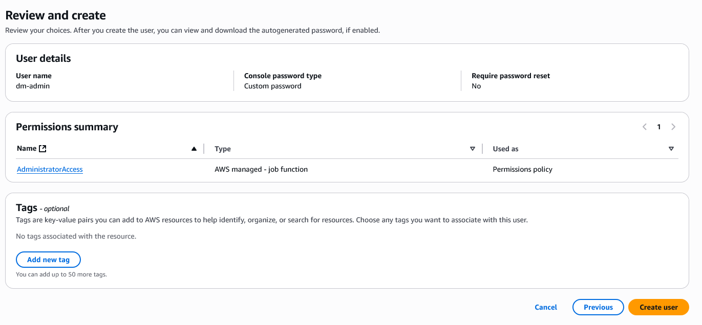
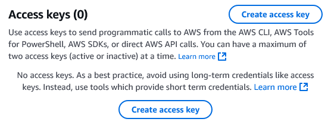

# Criação de Usuário com Permissão AdministratorAccess

Este guia descreve o processo para criar um usuário IAM com permissões administrativas (`AdministratorAccess`) na AWS. Esse tipo de usuário possui acesso total a todos os recursos e serviços da conta, portanto, deve ser criado com cautela e utilizado apenas quando necessário.

---

## Etapas para criar um usuário com AdministratorAccess

### 1. Acesse o Console IAM
Acesse o console de gerenciamento da AWS e navegue até o serviço **IAM (Identity and Access Management)**.

---

### 2. Clique em “Users” no menu lateral e depois em “Create users”


---

### 3. Defina o nome do usuário e as opções de acesso

Nesta etapa, vamos configurar as credenciais de acesso do novo usuário.

- **User name:** escolha um nome descritivo e consistente com o propósito do usuário. Exemplo: `dm-admin`
- Marque a opção **"Provide user access to the AWS Management Console"**
    - Este acesso é necessário, pois algumas tarefas administrativas (como configurações manuais) são feitas diretamente pelo Console.
- Em **"Are you providing console access to a person?"**, selecione:
    - **"I want to create an IAM user"**
- Em **Console password**, escolha:
    - **Custom password** e defina uma senha segura para o usuário
- A opção **"Users must create a new password at next sign-in"** é opcional. Marque apenas se for entregar esse usuário para outra pessoa.


---

### 4. Conceda permissões administrativas ao usuário

Nesta etapa, vamos vincular a política `AdministratorAccess` diretamente ao usuário criado.

- Em **Permissions options**, selecione **Attach policies directly**
- No campo de busca, digite `AdministratorAccess`
- Marque a política **AdministratorAccess** (AWS managed – job function)

> Essa política concede acesso total a todos os serviços e recursos da conta. Use com cautela e apenas para usuários confiáveis e técnicos.


---

### 5. Revise e crie o usuário

Na etapa final, revise todas as configurações antes de concluir a criação do usuário.

- Verifique o **User name**, o tipo de senha configurada e se a política `AdministratorAccess` foi corretamente vinculada.
- A seção **Tags** é opcional, mas pode ser útil para identificar recursos futuramente (ex: `project=datamaster` ou `env=dev`).
- Clique em **Create user** para finalizar.



---

### 6. Recupere as credenciais de acesso

Após a criação do usuário, será exibida a tela com os dados de login:

- **Console sign-in URL:** link direto para o login da conta AWS
- **User name:** o nome do usuário criado
- **Console password:** a senha configurada anteriormente

> **Importante:** esta é a **única vez** que a senha ficará visível. Clique em **Download .csv file** para salvar as credenciais com segurança. Guarde esse arquivo em local protegido — ele será necessário para autenticar na CLI posteriormente.


---

### 7. Testar o acesso do novo usuário

Após concluir a criação do usuário, é importante verificar se o acesso está funcionando corretamente.

- Acesse a [Console AWS](https://aws.amazon.com/console/) utilizando o **Console sign-in URL** gerado (formato: `https://<AccountID>.signin.aws.amazon.com/console`)
- Faça login com o **user name** e a **senha** definidos durante o processo
- Verifique se o usuário consegue:
  - Acessar os serviços AWS normalmente
  - Ver as configurações da conta
  - Criar e editar recursos (como testes simples em S3 ou IAM)
- Se necessário, altere a senha na primeira entrada (caso tenha ativado a opção de troca obrigatória)

> Caso tudo funcione como esperado, o usuário `dm-admin` já está pronto para uso via Console.

---

### 8. Criar chaves de acesso para uso com AWS CLI

Para usar o novo usuário via CLI, SDKs ou outras ferramentas automatizadas, é necessário gerar uma **Access Key**.

1. Acesse o serviço **IAM** no Console AWS
2. Clique na aba **Users** e selecione o usuário criado (ex: `dm-admin`)
3. Vá até a seção **Security credentials**
4. Em **Access keys**, clique em **Create access key**



---

### 9. Especifique o uso da Access Key

Durante a criação da chave de acesso, a AWS recomenda indicar o propósito da chave para fins de segurança e auditoria.

- No passo **Access key best practices & alternatives**, selecione o uso pretendido:
  - Marque **Command Line Interface (CLI)**, pois a chave será utilizada para autenticação via AWS CLI

- Em seguida, a etapa **Set description tag** será exibida:
  - Essa etapa é **opcional**, mas você pode adicionar tags como `project=datamaster` ou `env=dev` para facilitar a identificação futura da chave.

- Após isso, clique em **Create access key** para gerar a credencial.

---

### 10. Recupere e armazene a Access Key com segurança

Após a criação, a tela final exibirá a `Access key` e a `Secret access key`. Essa é a **única vez** que você poderá visualizar a chave secreta.

- Copie e salve os valores com segurança
- Clique em **Download .csv file** para baixar o par de chaves em formato seguro
- Depois disso, clique em **Done** para finalizar
- Siga as boas práticas de segurança para armazenar essas chaves, como usar um gerenciador de senhas ou um cofre seguro.

> Se você perder a `Secret access key`, será necessário revogar esta e criar uma nova.


---

### 11. Configurar o perfil do usuário na AWS CLI

Se você pretende utilizar a AWS CLI de forma prática e reutilizável, é recomendável configurar um **profile** nomeado no seu ambiente. 

> Esta configuração é **opcional**. Também é possível autenticar via CLI utilizando diretamente os `Access Key` e `Secret Key`, mas o uso de perfis é mais seguro e escalável.

### Linux / macOS

Edite os arquivos:

`~/.aws/credentials`
```ini
[datamaster]
aws_access_key_id = SUA_ACCESS_KEY
aws_secret_access_key = SUA_SECRET_KEY
```

`~/.aws/config`
```ini
[datamaster]
region = us-east-1 (ou outra região desejada)
```

### Windows

Os arquivos ficam em:

```ini
C:\Users\SEU_USUARIO\.aws\credentials
C:\Users\SEU_USUARIO\.aws\config
```

A estrutura é a mesma dos exemplos acima.
