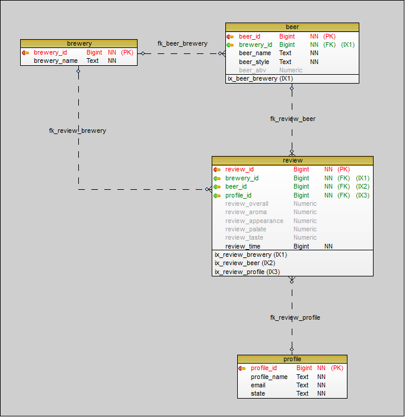
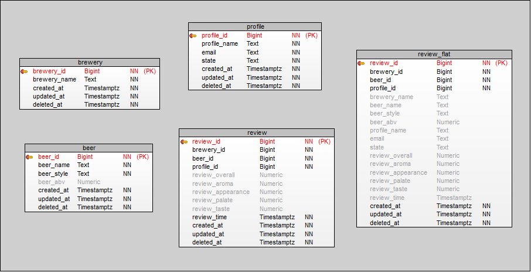
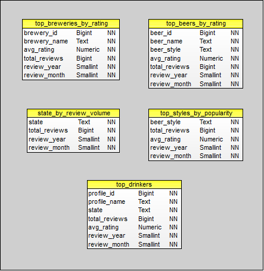

# Modelo de Entidade-Relacionamento (MER)

Antes de apresentar a arquitetura do projeto, é fundamental entender a **estrutura lógica dos dados** utilizados. Para isso, foram criados três schemas distintos que representam as camadas do data lake: `dm_core`, `dm_view` e `dm_mart`. Cada um deles foi utilizado para estruturar e validar os modelos relacionais correspondentes às camadas **bronze**, **silver** e **gold**.

Esses schemas foram criados diretamente no banco relacional e serviram como base para o catálogo do AWS Glue. Embora nem todos sejam populados com dados, eles tiveram papel essencial no desenho, validação e implementação do pipeline de dados.

---

## Camada Bronze — `dm_core`

Os dados brutos do BeerAdvocate foram organizados em um schema relacional chamado **`dm_core`**, que representa o modelo conceitual da plataforma de avaliações de cerveja. Esse schema serviu de base para a derivação da camada **bronze**, mantendo os relacionamentos entre entidades de forma clara e normalizada.

> Foi sobre esse schema que o **CDC (Change Data Capture)** foi ativado, permitindo capturar alterações de forma contínua para alimentar a esteira de ingestão.

### Descrição das entidades

- **`brewery`**  
  Contém informações sobre cervejarias. Cada cervejaria é identificada por `brewery_id` e possui um nome (`brewery_name`).

- **`beer`**  
  Representa as cervejas produzidas pelas cervejarias. Cada registro inclui `beer_name`, `beer_style`, o teor alcoólico (`beer_abv`) e uma chave estrangeira para a cervejaria (`brewery_id`).

- **`profile`**  
  Contém perfis de usuários que realizaram avaliações. Os dados incluem `profile_name`, `email` e o estado de origem (`state`). Todos os dados dessa tabela são sintéticos, exceto os nomes de perfil, que são públicos.

- **`review`**  
  Armazena as avaliações feitas por usuários sobre as cervejas. Cada avaliação contém notas para diversos aspectos sensoriais (`aroma`, `appearance`, `palate`, `taste`), além de uma nota geral (`review_overall`) e o timestamp da avaliação (`review_time`). As foreign keys ligam essa tabela às entidades `brewery`, `beer` e `profile`.

### Relacionamentos

- Uma **cervejaria** pode produzir várias **cervejas**.
- Uma **cerveja** pode ter várias **avaliações**.
- Um **usuário (profile)** pode fazer várias **avaliações**.
- Cada **avaliação** referencia a **cervejaria**, **cerveja** e **usuário** correspondente.

> Essa estrutura lógica foi a base para o mapeamento inicial da camada **bronze**, permitindo manter a rastreabilidade dos dados e facilitar futuras transformações nas camadas **silver** e **gold**.

---

## Camada Silver — `dm_view`

Para facilitar o planejamento e entendimento das transformações realizadas na **camada silver**, foi criado o schema **`dm_view`**. Ele simula as tabelas pós-processamento da bronze, servindo como guia para enriquecimento, versionamento e organização dos dados para consumo analítico.

### O que muda em relação ao `dm_core`?

1. **Padronização temporal**  
   Todas as tabelas passaram a contar com colunas de auditoria: `created_at`, `updated_at` e `deleted_at`, usando o tipo `timestamptz`. Isso permite controle de histórico e suporte a *soft deletes*.

2. **Enriquecimento de dados**  
   A tabela `review_flat` foi adicionada como uma **visão desnormalizada** das tabelas `review`, `beer`, `brewery` e `profile`. Ela representa um dos **principais outputs da camada silver**, e é a **fonte base** para as análises da camada **gold**.

3. **Preparação para deduplicação e versionamento**  
   Com a inclusão de metadados temporais e a separação clara entre entidades, a estrutura do `dm_view` viabiliza transformações confiáveis e consistentes, com suporte a operações incrementais.

> Embora o `dm_view` não seja populado diretamente, sua criação foi essencial para validar as regras de transformação, definir chaves e particionamentos, e estruturar a camada silver com foco em qualidade e rastreabilidade.

---

## Camada Gold — `dm_mart`

Assim como a `dm_view` serviu como referência para a silver, o schema **`dm_mart`** foi criado para simular a estrutura final da **camada gold**. Ele foi projetado com foco em **consumo analítico**, organizando os dados em agregações mensais, normalizadas e prontas para visualização.

### Tabelas agregadas e suas finalidades

- **`top_breweries_by_rating`**  
  Cervejarias com melhor média de avaliação em um determinado mês.

- **`top_beers_by_rating`**  
  Destaque das melhores cervejas por nota média e volume de avaliações, agrupadas por estilo e período.

- **`top_styles_by_popularity`**  
  Estilos de cerveja mais populares com base no número de reviews e nota média.

- **`state_by_review_volume`**  
  Volume de avaliações por estado de origem do usuário.

- **`top_drinkers`**  
  Usuários mais ativos e suas médias de avaliação, por mês e estado.

### Design orientado a consumo analítico

Todas as tabelas seguem um padrão de:

- **Particionamento por `review_year` e `review_month`**, otimizando performance em consultas via Athena.
- **Colunas agregadas e estruturadas**, eliminando a necessidade de joins para visualização.
- **Granularidade mensal**, ideal para análise de tendências e painéis executivos.

> O schema `dm_mart` foi essencial para validar o modelo final da camada gold, garantindo que as tabelas refletissem as necessidades de negócio com alta performance e clareza semântica.

---

[Voltar para a página inicial](../README.md#documentação)
