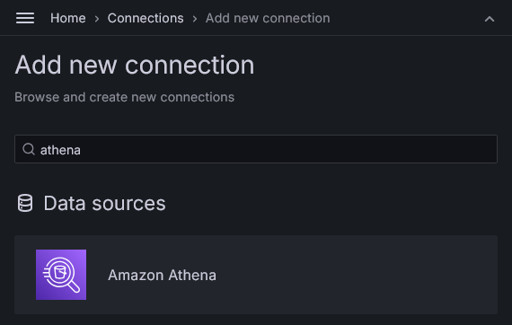
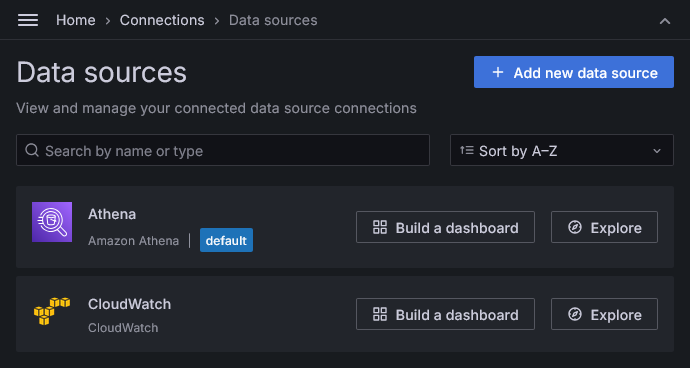
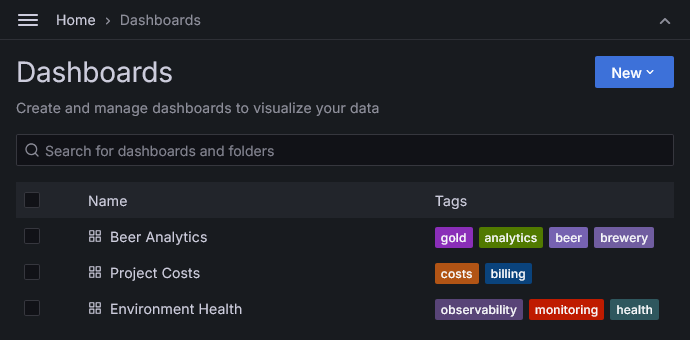

# DataViz e Observabilidade

A etapa de **DataViz e Observabilidade** tem como foco **visualizar, monitorar e analisar** os dados e operações do lake house, fornecendo **insights de negócio**, **visibilidade operacional** e **controle de custos**. Utiliza principalmente o **Grafana** como ferramenta de dashboarding, com integração a fontes como **Athena**, **CloudWatch** e métricas de billing da própria AWS.

## Objetivo

Permitir a criação de dashboards que combinem:

* **Indicadores analíticos** extraídos das tabelas da camada *gold*
* **Indicadores operacionais** (volume de dados, status de processamento, tentativas com erro etc.)
* **Indicadores financeiros**, incluindo **custos de processamento**, armazenamento e execução de jobs

## Observação Importante

> Esta é uma das poucas etapas do projeto com **ações manuais obrigatórias**, devido a **limitações de permissões e automação** relacionadas ao Grafana e à integração com métricas de custo da AWS.
>
> Embora a **workspace do Grafana seja provisionada automaticamente via CloudFormation**, a **configuração de autenticação (IAM Identity Center / SSO)** exige intervenção manual no console da AWS.
>
> Além disso, a **ativação e configuração do Cost and Usage Report (CUR)**, necessária para visualizar métricas de custo no Athena, também deve ser feita manualmente, e somente com a conta root da AWS.

---

## 1. Configuração da Autenticação (IAM Identity Center / SSO)

Antes que os dashboards possam ser acessados ou modificados via interface web, é necessário habilitar a **autenticação via AWS IAM Identity Center (SSO)** no workspace do Grafana. Este processo **não pode ser automatizado via CloudFormation** e requer permissões administrativas específicas.

Guia completo disponível em: [`grafana-auth.md`](grafana-auth.md)

---

## 2. Instalação de plugins no Grafana

Antes de executar o comando para criação de datasources e dashboards via CLI, é necessário garantir que os **plugins necessários estejam instalados** no workspace Grafana.

### Plugin do CloudWatch

O plugin do **CloudWatch** já vem pré-instalado no AWS Managed Grafana. Nenhuma ação é necessária.

### Plugin do Amazon Athena (instalação manual obrigatória)

Embora o datasource do Athena seja criado automaticamente via CLI, a **instalação do plugin do Amazon Athena ainda precisa ser feita manualmente via interface web**, pois o Grafana não permite instalação automatizada de plugins em workspaces gerenciados.

#### Etapas para instalação:

1. Acesse o workspace do Grafana (`dm-grafana-workspace`) com um usuário com permissão de **Admin**
2. No menu lateral, clique em **Connections → Add new connection**
3. Use o campo de busca e filtre por **Athena**
4. Localize o plugin **Amazon Athena** e clique para abrir
5. No canto superior direito da tela, clique em **Install 3.1.6** (versão atual no momento da documentação)



> Após a instalação, o botão muda para **Add new data source** — **não é necessário clicar**, pois a criação será feita automaticamente pelo CLI no próximo passo.

---

## 3. Criação das dashboards via CLI

Após concluir a configuração inicial do Grafana, a criação das dashboards do projeto pode ser realizada com um único comando:

```text
>>> grafana
```

Ao executar o comando, o sistema exibirá uma mensagem de confirmação antes de prosseguir:

```text
>>> grafana
You are about to create all available Grafana dashboards.
Type 'go' to continue: go
```

Após a confirmação, o CLI realiza as seguintes ações:

1. **Criação dos datasources** necessários:
    * **Athena** (para análises baseadas nos dados da camada gold)
    * **CloudWatch** (para métricas operacionais e logs)
2. **Criação automatizada das dashboards** disponíveis no projeto:
    * `analytics`: indicadores analíticos extraídos do data lake
    * `costs`: métricas de custo por serviço
    * `health`: monitoramento dos workers da infraestrutura

> Por padrão, o comando cria ou atualiza **todas** as dashboards disponíveis. Para aplicar filtros, use a flag `--dashboard`.

---

### 4. Verificar se o comando foi executado com sucesso

Após executar o comando `grafana` e aguardar a criação automatizada dos recursos, é importante **verificar se os datasources e dashboards foram corretamente criados** no Grafana.

#### Verificando os datasources

No menu lateral, acesse: **Connections → Data sources**

Você deverá ver os seguintes datasources criados automaticamente:

* **Athena** (marcado como `default`)
* **CloudWatch**



---

#### Verificando as dashboards

No menu lateral, acesse: **Dashboards**

As seguintes dashboards devem estar listadas:

1. **Beer Analytics**
   (Indicadores analíticos baseados em dados da camada *gold*)
2. **Project Costs**
   (Visualização de custos por serviço e componente do projeto)
3. **Environment Health**
   (Status operacional e métricas de saúde do ambiente)



---

> A seguir, descreveremos o conteúdo de cada uma das dashboards criadas e como interpretá-las.

---

## Dashboard: Beer Analytics

O dashboard **Beer Analytics** apresenta uma visão analítica consolidada com base nas tabelas da camada *gold*, permitindo identificar padrões de consumo, preferências por estilo e performance de produtos e marcas. Ele é dividido em **cinco painéis principais**:

---

### 1. **Top 10 Beers by Rating**

Exibe uma tabela com as 10 cervejas mais bem avaliadas com base na média de avaliação (`Avg Rating`), calculada a partir das notas dos usuários.

* **Fonte de dados**: `dm_gold.top_beers_by_rating`
* **Objetivo**: identificar os rótulos mais apreciados pela comunidade.
* **Colunas**:

   * **Beer**: nome da cerveja
   * **Avg Rating**: nota média

---

### 2. **Top 10 Breweries by Rating**

Mostra as 10 cervejarias com melhor avaliação média agregada a partir das suas cervejas.

* **Fonte de dados**: `dm_gold.top_breweries_by_rating`
* **Objetivo**: destacar os produtores com melhor reputação entre os consumidores.
* **Colunas**:

   * **Brewery**: nome da cervejaria
   * **Avg Rating**: nota média

---

### 3. **Review Volume by State**

Painel geográfico que apresenta, sobre um mapa dos Estados Unidos, o volume de reviews por estado — representado visualmente pelo tamanho dos círculos.

* **Fonte de dados**: `dm_gold.state_by_review_volume`
* **Objetivo**: entender a distribuição geográfica da base de consumidores e os principais mercados ativos.

---

### 4. **Popular Styles (Volume × Rating)**

Tabela com os estilos de cerveja mais populares, ordenada pelo volume de reviews, e acompanhada da nota média de cada estilo.

* **Fonte de dados**: `dm_gold.top_styles_by_popularity`
* **Objetivo**: identificar tendências de estilo e equilíbrio entre popularidade e qualidade percebida.
* **Colunas**:

   * **Style**: estilo da cerveja
   * **Reviews**: total de reviews recebidos
   * **Avg Rating**: média das notas

---

### 5. **Top Drinkers**

Gráfico de barras horizontais com os usuários mais ativos em número de reviews registrados.

* **Fonte de dados**: `dm_gold.top_drinkers`
* **Objetivo**: visualizar o engajamento da base de usuários e identificar os principais avaliadores.
* **Dado exibido**:

   * **Username (de domínio público)** e **quantidade de reviews**

---

### Filtros por período (Year & Month)

Todos os painéis do dashboard **Beer Analytics** são dinamicamente filtráveis pelos campos **Year** e **Month**, conforme exibido na parte superior da interface.

Esses campos correspondem diretamente às **partições das tabelas da camada `gold`**, otimizando o desempenho das consultas no Athena e evitando leitura desnecessária de dados.

> Essa abordagem permite navegar por períodos específicos com consultas altamente performáticas e custo reduzido.

---

## Dashboard: Environment Health

O dashboard **Environment Health** tem como objetivo **monitorar a saúde operacional do ambiente**, detectando falhas, gargalos ou comportamentos anômalos nos principais componentes do pipeline.

Ele coleta métricas diretamente do **CloudWatch** e consolida os dados em seis painéis principais:

Este dashboard fornece uma **visão consolidada de saúde operacional**, e pode ser usado tanto para **monitoramento contínuo** quanto para **análise forense em caso de falhas**.

---

### Lambda Invocations

Mostra a contagem de execuções (invocações) de funções Lambda ao longo do tempo.

* **Funções monitoradas**:

   * `dm-firehose-router`
   * `dm-processing-controller`
   * `dm-bronze-ingestor-lite`
* **Objetivo**: identificar picos de uso, frequência de execução e carga de trabalho associada a cada função.

---

### Lambda Errors

Exibe o número de erros registrados nas execuções das mesmas funções Lambda.

* **Objetivo**: detectar falhas de execução (ex: timeouts, exceções, falhas de permissão)
* **Análise esperada**: um aumento aqui, sem correspondente em invocations, pode indicar falhas sistemáticas.

---

### Step Functions ExecutionsSucceeded

Contabiliza execuções bem-sucedidas em cada uma das Step Functions do pipeline.

* **Step Functions monitoradas**:

   * `dm-ingestion-dispatcher`
   * `dm-processing-dispatcher`
   * `dm-analytics-dispatcher`
* **Objetivo**: acompanhar a fluidez do pipeline e confirmar o sucesso das execuções agendadas ou disparadas por eventos.

---

### Step Functions ExecutionsFailed

Mostra o número de execuções com falha nas mesmas Step Functions.

* **Objetivo**: alertar sobre pipelines que não concluíram corretamente, facilitando a investigação por data/hora e ARN.
* **Importância**: falhas aqui podem indicar problemas em camadas downstream (como falta de input, erro em jobs Spark, etc.).

---

### EMR SuccessJobs

Registra a quantidade de jobs bem-sucedidos no EMR Serverless.

* **Objetivo**: garantir que os jobs Spark de transformação (silver e gold) estão sendo executados corretamente.
* **Métrica usada**: `SuccessJobs` de cada application ID.

---

### EMR FailedJobs

Exibe a quantidade de jobs com falha no EMR Serverless.

* **Objetivo**: identificar rapidamente falhas nos jobs de transformação — especialmente úteis durante ajustes em lógica de ETL.
* **Análise recomendada**: falhas consecutivas devem ser investigadas via logs do EMR e/ou mensagens de erro na control table (`dm-processing-control`).

---

### Filtro por intervalo de tempo

Diferente das dashboards analíticas, que utilizam partições por `year` e `month`, o dashboard **Environment Health** é baseado inteiramente em métricas do **CloudWatch**, e por isso, o controle de período é feito usando o **filtro de tempo global** do Grafana (disponível no canto superior direito).

Você pode selecionar:

* Ranges relativos (ex: "Last 15 minutes", "Last 3 hours", "Last 7 days")
* Ranges absolutos (ex: de `now-30d` até `now`)
* Qualquer combinação personalizada com suporte ao formato nativo do Grafana

> Essa funcionalidade permite investigar comportamentos específicos por data/hora, validar execuções recentes ou acompanhar falhas recorrentes.

--- 

## Dashboard: Project Costs

O dashboard **Project Costs** foi concebido para oferecer uma **visão financeira detalhada** do ambiente Data Master, permitindo acompanhar a evolução dos gastos por serviço, componente e período. Ele se apoia no **Cost and Usage Report (CUR)** da AWS, exportado em formato **Parquet** e consultado via **Athena**, com integração ao Grafana.

### Objetivo

* Monitorar o custo diário do ambiente, com granularidade por serviço (ex: S3, Athena, EMR, Lambda)
* Identificar picos de consumo e tendências de custo
* Suportar decisões de otimização financeira e trade-offs arquiteturais

### Observação importante

> Esta é, de longe, a etapa **com maior nível de manualidade** do projeto, devido a **limitações da AWS** na automação da geração e disponibilização do CUR.

Embora o dashboard seja criado automaticamente via CLI, a **integração de dados depende de diversas ações manuais**:

* Habilitação do **Cost and Usage Report (CUR)** no console de Billing
* Espera de até **24 horas** para o primeiro ciclo de geração
* Execução manual do script `CREATE EXTERNAL TABLE` no Athena

### Guia passo a passo

Para seguir corretamente todas essas etapas, utilize o tutorial:

[Como habilitar o Cost and Usage Report (CUR) e integrá-lo ao Athena](cur.md)

> Após essa configuração inicial, o pipeline passa a funcionar de forma contínua, com novos arquivos sendo gerados e automaticamente reconhecidos no Athena (desde que o particionamento continue sendo reparado regularmente).

---

[Voltar para a página inicial](../README.md#documentação) | [Próximo: Governança e Segurança de Dados](governance.md)