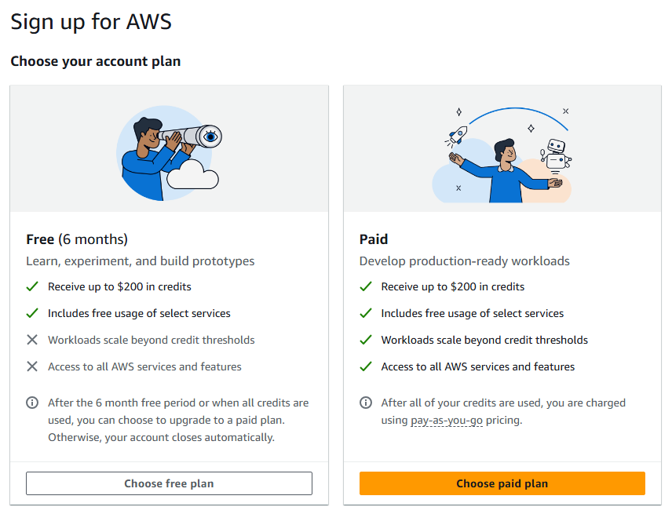
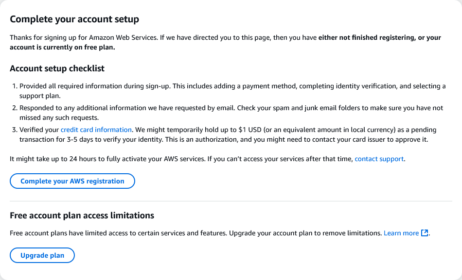

# Pré-Requisitos

Antes de começar, você precisa ter o seguinte ambiente configurado:

### 1. [Go 1.24+](https://go.dev/doc/install)

O CLI é escrito em Go e requer a versão 1.24 ou superior.

* Instruções de instalação: [go.dev/doc/install](https://go.dev/doc/install)
* Verifique a versão com:

```bash
go version
```

---

### 2. [Git](https://git-scm.com/downloads)

Utilizado para clonar o repositório e interagir com o projeto localmente.

* Baixe o Git: [git-scm.com/downloads](https://git-scm.com/downloads)
* Verifique a instalação com:

```bash
git --version
```

---

### 3. [Docker](https://www.docker.com/products/docker-desktop)

O CLI depende do Docker para carregar, taguear e publicar imagens em repositórios ECR. Certifique-se de que o Docker esteja instalado e rodando.

* Baixe o Docker Desktop: [docker.com/products/docker-desktop](https://www.docker.com/products/docker-desktop)
* Verifique a instalação com:

```bash
docker version
```

---

### 4. Conta na [AWS](https://aws.amazon.com/)

Você precisa de uma conta **ativa e com acesso completo aos serviços da AWS**.

Embora o projeto aproveite praticamente todos os serviços incluídos no Free Tier, o **Amazon Athena não faz parte do Free Tier**.

#### Como criar sua conta corretamente:

1. Acesse: [https://aws.amazon.com/](https://aws.amazon.com/)
2. Siga o processo de criação e, quando chegar na etapa “Choose your account plan”, **clique em “Choose paid plan”** como mostrado abaixo:



> Como mencionado, o projeto utiliza o Amazon Athena, que **não está disponível** no plano "Free (6 months)". Escolher o plano "Paid" é obrigatório, mesmo que você utilize uma parcela pequena dos créditos gratuitos para cobrir os custos para reproduzir o projeto.

---

### 5. Usuário com permissão **AdministratorAccess**

Crie um usuário IAM com permissões administrativas completas para executar todo o provisionamento via CLI.

* Guia para criar um usuário com `AdministratorAccess`:
  [Criar usuário IAM com permissão administrativa](iam-admin-access.md)

> Durante a autenticação no CLI, você poderá usar tanto **AWS Profile** quanto **Access Key / Secret Key** desse usuário.

---

### 6. Inicialização do Lake Formation (obrigatório uma única vez)

Antes de executar qualquer comando do CLI que envolva permissões no Lake Formation, é necessário inicializar o Lake Formation na conta.

> ⚠️ **Esse passo deve ser feito com o mesmo usuário IAM recém-criado que será usado para autenticar na CLI e provisionar o ambiente.**

> ⚠️ **Importante:** o Lake Formation é um serviço **regional**.  
> Certifique-se de que está acessando o console na **mesma região** onde o projeto será provisionado (ex: `N. Virginia (us-east-1)`).  
> Ativar o Lake Formation em outra região (como `Ohio`) causará erros de permissão mesmo que tudo pareça estar correto.

> ❌ **Não use o usuário root da conta AWS para essa etapa.**

**Passos obrigatórios:**

1. Acesse o console da AWS na **região correta**:  
   [https://console.aws.amazon.com/lakeformation/home?region=us-east-1](https://console.aws.amazon.com/lakeformation/home?region=us-east-1)
2. Clique em **"Get started"**
3. Marque a opção **"Add myself"**
4. Clique em **"Get started"** para confirmar

Isso tornará o usuário atual um **administrador do Lake Formation** naquela região, permitindo que o CLI conceda permissões automaticamente durante o provisionamento.

> Esse passo precisa ser feito **apenas uma vez por conta e por região**. Após isso, todo o provisionamento segue via CLI.

---

### 7. Verifique se sua conta AWS suporta o Amazon Athena

O Amazon Athena **não é compatível com contas no plano gratuito limitado (Free 6 months)**. Se você tentar provisionar o ambiente com esse tipo de conta, verá erros como:

```
The AWS Access Key Id needs a subscription for the service (Service: Athena)
```
#### Para resolver:

1. Acesse o console do Athena: [https://console.aws.amazon.com/athena/](https://console.aws.amazon.com/athena/)
2. Se for redirecionado para a tela de configuração de conta (como na imagem abaixo), clique em `Upgrade plan` e siga os passo para mudar sua conta para o plano pago.



---

[Voltar para a página inicial](../README.md#documentação)