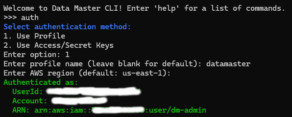

# Provisionamento do Ambiente

Quase todo o provisionamento do ambiente é feito via CLI, garantindo reprodutibilidade e padronização da infraestrutura. No entanto, ainda existem alguns poucos passos manuais necessários — geralmente relacionados a permissões específicas — como a configuração da autenticação no Grafana e a habilitação das métricas de Billing para visualização de custos.

Apesar do processo estar altamente automatizado, ele envolve múltiplos serviços e etapas que devem ser seguidas com atenção e na ordem descrita abaixo para garantir o funcionamento correto do ambiente.

## Etapas de Provisionamento

### 1. Executar o CLI `datamaster`

Certifique-se de que o CLI `datamaster` foi instalado corretamente. Você pode iniciar a interface interativa de duas formas:

- Se o binário estiver instalado corretamente no seu PATH:
```
datamaster
```

- Alternativamente, execute o CLI diretamente a partir do código-fonte:
```
go run ./main.go
```
  
---

### 2. Autenticar com a AWS

Após iniciar a CLI, o primeiro comando a ser executado é:
```
auth
```

Você será solicitado a selecionar o método de autenticação:

```
Select authentication method:
1. Use Profile
2. Use Access/Secret Keys
```

Você pode escolher:

* **Opção 1 (Profile):** informe o nome do AWS Profile (ou deixe em branco para usar o `default`).
* **Opção 2 (Access/Secret):** insira sua AWS Access Key e Secret Key manualmente.

Em ambos os casos, também será solicitado o nome da **região AWS** (padrão: `us-east-1`).

Exemplo de resposta esperada após autenticação bem-sucedida:



> Essa autenticação é necessária para permitir a execução dos comandos que criam e gerenciam recursos na AWS.

---

### 3. Executar o deploy das stacks

Com a autenticação feita, o próximo passo é executar o deploy de todas as stacks com o comando:

```
>>> deploy
````

Confirme a execução digitando `go` quando solicitado:

```
You are about to deploy all stacks.
Type 'go' to continue: go
```

Esse comando cria todos os recursos necessários do projeto usando os templates do CloudFormation de forma automatizada.

Se todas as stacks forem criadas com sucesso, no final você verá uma mensagem de confirmação como esta:

```
All stacks deployed successfully!
```

> Para entender o propósito de cada stack, consulte a seção **[Componentização da Arquitetura por Stacks](./stacks.md).**

> **Atenção**: Certifique-se de que o Docker Desktop esteja iniciado antes de executar esse comando. Algumas imagens precisam ser construídas e enviadas para o Amazon ECR durante esse processo.

> **Importante:** Todo o ambiente será provisionado neste passo. O tempo total leva aproximadamente 1 hora, principalmente devido à criação de recursos como **Aurora, Kinesis, DynamoDB, e Clusters (DMS, ECS, EMR)**. A conexão local tem impacto mínimo nesse processo.

> Além das mensagens exibidas durante a execução, o **acompanhamento detalhado de cada stack** pode ser feito diretamente pelo console da AWS, na seção **CloudFormation → Stacks**.

---

### 4. Executar os scripts de migração no Aurora

Após o provisionamento das stacks, o próximo passo é executar os scripts SQL no **Aurora**, que criam os schemas `dm_core`, `dm_view` e `dm_mart`. Esses schemas representam, respectivamente, as camadas **bronze**, **silver** e **gold** do data lake.

Embora apenas o schema `dm_core` seja efetivamente populado com dados reais (para fins de ingestão via DMS ou seed), os demais (`dm_view` e `dm_mart`) foram criados como **base para a modelagem conceitual** das camadas superiores, servindo como referência direta para a estrutura das tabelas nas camadas silver e gold.

Na CLI, execute:

```
>>> migration
````

Confirme a execução digitando `go` quando solicitado:

```
You are about to run all migration scripts in order.
Type 'go' to continue: go
```

Ao final da execução bem-sucedida de todos os scripts, você verá uma mensagem como esta:

```
All migration scripts executed successfully!
```

> **Observação**: Após a criação do schema `dm_core`, a task de replicação via DMS será automaticamente iniciada. Isso pode levar alguns minutos na primeira execução.

> **Dica**: Caso queira acompanhar a task de replicação com mais detalhes, você pode acessar diretamente a [console do AWS DMS](https://us-east-1.console.aws.amazon.com/dms/v2/).

---

### 5. Criar os catálogos no Glue

Com os dados replicando no Aurora e as estruturas criadas, o próximo passo é registrar todas as tabelas nos catálogos do AWS Glue para permitir consultas estruturadas nas camadas `bronze`, `silver` e `gold`.

Na CLI, execute:

```
>>> catalog
You are about to create all Glue tables for the following databases:
- bronze
- silver
- gold
Type 'go' to continue: go
````

A saída esperada mostra a criação bem-sucedida das tabelas em cada camada, e ao final a mensagem:

```
Catalog creation completed successfully.
```

> **Importante**: Esse comando garante que todas as tabelas esperadas fiquem visíveis no Glue Catalog, permitindo que ferramentas como Athena, EMR e Lake Formation possam acessá-las corretamente.

> Caso queira criar apenas uma camada ou um subconjunto de tabelas, consulte a documentação do comando `help catalog` para ver as flags disponíveis.

---

Com a execução desses passos, o ambiente estará completamente provisionado e operacional. Todas as stacks estarão criadas, o banco de dados inicializado e a replicação contínua de dados via DMS ativa.

A partir daqui, você já pode seguir com as etapas de ingestão, processamento e análise de dados conforme definido nos demais módulos do projeto.

---

[Voltar para a página inicial](../README.md#documentação) | [Próximo: Ingestão de Dados (Bronze)](ingestion.md)
