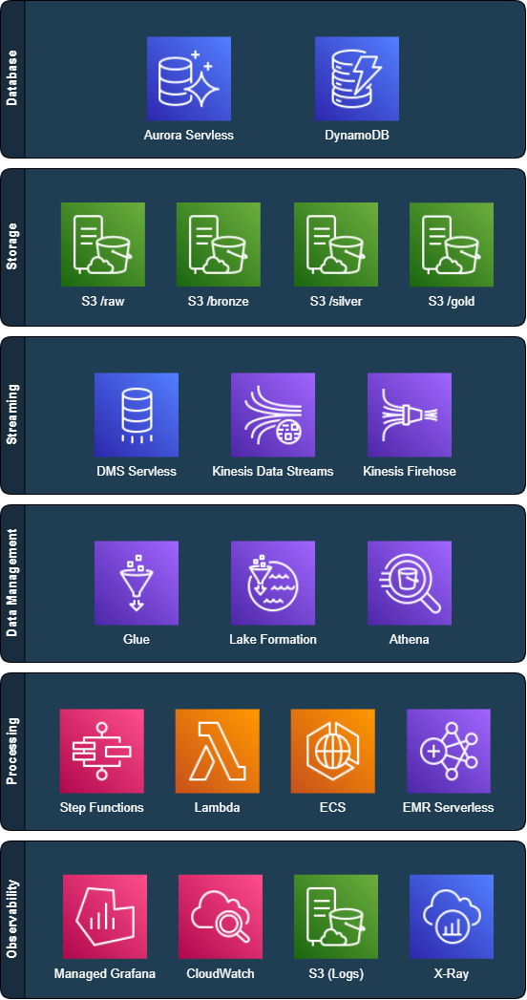
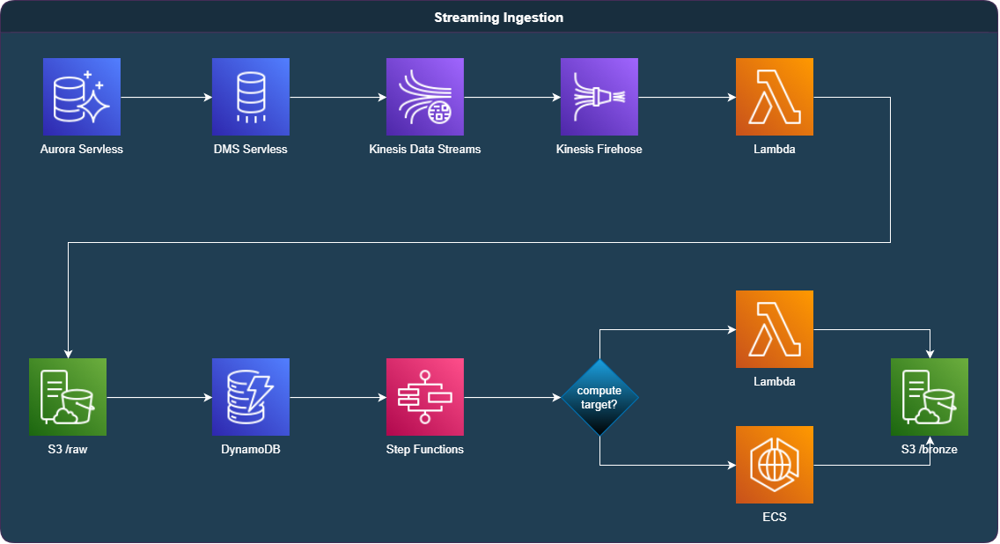
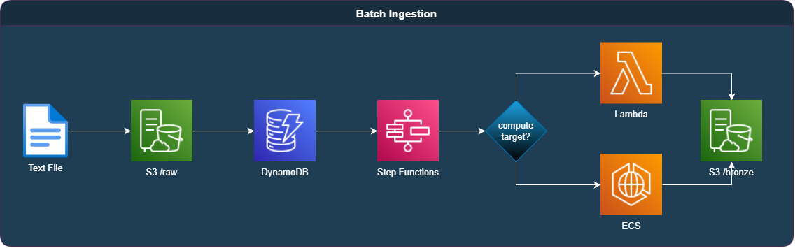
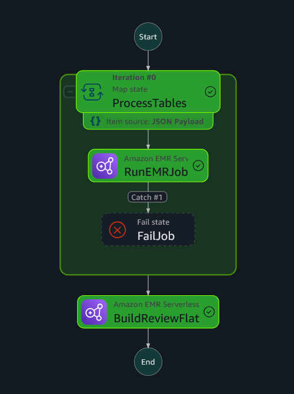
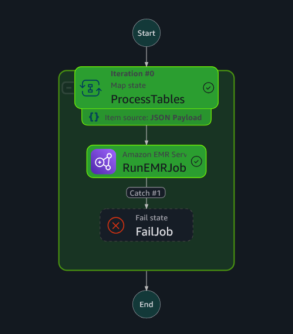

# Relatório Técnico — Projeto Data Master

## I. Objetivo do Case

O projeto apresentado tem como objetivo demonstrar, de forma estruturada, completa e reprodutível, a aplicação dos principais pilares da Engenharia de Dados moderna, conforme exigido pelo programa de certificação **Data Master**.

A proposta foi concebida como um ambiente realista, escalável e **orientado a eventos (event-driven)** para ingestão, processamento, armazenamento, análise e visualização de dados. O cenário simula a construção de um **Data Lake modular e serverless**, suportando ingestão de grandes volumes de dados oriundos de um sistema OLTP simulado (Aurora PostgreSQL), com transformações disparadas por eventos e organizadas de acordo com o padrão **Medallion Architecture** (raw, bronze, silver, gold).

Diferente de abordagens genéricas ou baseadas em stacks pré-configuradas, este projeto foi idealizado **desde o zero**, priorizando decisões arquiteturais fundamentadas, práticas reais de mercado e capacidade de evolução. Toda a solução foi construída com foco em **baixo custo operacional**, **infraestrutura como código (IaC)**, **monitoramento e governança de ponta a ponta**, **flexibilidade para evoluções futuras** e **alinhamento com boas práticas e requisitos de compliance**.

### Justificativa e Cenário

A inspiração para o case partiu de um cenário recorrente em projetos reais de data platform: a necessidade de absorver dados de sistemas OLTP (como PostgreSQL), processá-los com alta rastreabilidade e baixo custo, e disponibilizá-los em estruturas otimizadas para análise, enriquecimento e visualização — tudo isso com **governança, controle de falhas e custo sob vigilância**.

A arquitetura segue o padrão **Medallion** (raw → bronze → silver → gold), onde cada camada possui um papel claro na organização e tratamento dos dados, com controle centralizado via **DynamoDB** e suporte tanto a **streaming quanto batch**. A escolha por serviços **serverless** como Lambda, Glue e EMR Serverless permite balancear performance e custo, enquanto a observabilidade é garantida com **Grafana, Athena e o Cost and Usage Report (CUR)**.

### Abordagem Experimental

Parte do projeto foi estruturada como uma **experiência técnica controlada** para comparar abordagens e validar decisões. Um exemplo disso foi a criação de um **benchmark técnico** entre diferentes formas de ingestão e escrita em Parquet (utilizando Go puro, EMR Serverless e Glue Job), com medição de desempenho, consumo de recursos e custo final.

Esse caráter experimental e iterativo fortalece a solução como um **case técnico maduro**, que não apenas funciona, mas também explora os trade-offs entre alternativas reais.

### Alinhamento com os Requisitos do Programa

| Requisito                                  | Como foi implementado                                                                                                      |
|--------------------------------------------|----------------------------------------------------------------------------------------------------------------------------|
| **1. Extração de Dados**                   | Dados extraídos de instância Aurora PostgreSQL Serverless via DMS com CDC, simulando ambiente real de produção.            |
| **2. Ingestão de Dados**                   | Streaming (DMS → Kinesis → Firehose) e batch (.gz), ambos com controle via DynamoDB e processamento em Go (Lambda ou ECS). |
| **3. Armazenamento de Dados**              | Armazenamento em S3 com particionamento por camada; uso de Parquet e Iceberg.                                              |
| **4. Observabilidade**                     | Dashboards no Grafana com métricas de saúde, falhas, tentativas e custo (via CUR).                                         |
| **5. Segurança de Dados**                  | Controle de acesso via IAM e Lake Formation, suporte a SSO, criptografia em repouso com KMS e auditoria via CloudTrail.    |
| **6. Mascaramento de Dados**               | Campos PII são detectados com uso de Comprehend e anonimizados já na Camada Bronze.                                        |
| **7. Arquitetura de Dados**                | Arquitetura em camadas (raw → bronze → silver → gold) com controle incremental via DynamoDB.                               |
| **8. Escalabilidade**                      | Serverless com auto-scaling nativo (Lambda, Glue, EMR); processamentos paralelos por tabela (Step Functions).              |
| **9. Reprodutibilidade da Arquitetura**    | Toda a infraestrutura é declarada via CloudFormation; execução e deploy via CLI interativa.                                |
| **10. Plano de Implementação e Melhorias** | Documentado em seção dedicada; melhorias técnicas mapeadas com viabilidade futura.                                         |

---

## II. Arquitetura de Solução e Arquitetura Técnica

A arquitetura do projeto **Data Master** foi construída com base nos princípios de modularidade, governança e escalabilidade, utilizando **serviços serverless da AWS** organizados em camadas lógicas e stacks independentes via **CloudFormation**.

A estrutura segue o padrão **Medallion Architecture** (raw, bronze, silver, gold), com suporte tanto a **streaming quanto batch**. Cada etapa do pipeline é acionada por **eventos**, compondo uma arquitetura **event-driven** e 100% reprodutível via código.

---

### 2.2 Arquitetura Técnica

A seguir, está representada a **arquitetura técnica da solução**, estruturada por camadas lógicas que agrupam os serviços da AWS de acordo com sua função no pipeline. O diagrama abaixo apresenta os principais componentes utilizados, todos implementados em um modelo **serverless, automatizado e observável**:

#### Database

* **Aurora Serverless**: origem relacional dos dados simulados, com suporte a **CDC (Change Data Capture)** via DMS.
* **DynamoDB**: armazena o controle de processamento dos arquivos (`raw`) e controla tentativas, status e timestamps de cada etapa do pipeline.

#### Storage

* **S3 /raw**: recebe os arquivos `.gz` oriundos do Firehose ou do upload manual (batch).
* **S3 /bronze**: recebe os dados transformados e convertidos para Parquet.
* **S3 /silver**: camada de dados tratados com enriquecimento e controle incremental.
* **S3 /gold**: tabelas analíticas derivadas da silver, otimizadas para consumo.

#### Streaming

* **DMS Serverless**: realiza a extração contínua dos dados via CDC.
* **Kinesis Data Streams**: canal de transporte dos eventos em tempo real.
* **Kinesis Firehose**: persistência dos dados no S3, com função Lambda de transformação.

#### Data Management

* **Glue**: utilizado para criar e manter o catálogo de tabelas particionadas.
* **Lake Formation**: aplica políticas de acesso granular por banco, tabela e coluna.
* **Athena**: motor de consulta analítica sobre o Data Lake (camada gold principalmente).

#### Processing

* **Step Functions**: orquestram as etapas de ingestão e transformação em todas as camadas.
* **Lambda**: processamento leve e rápido (até \~100 mil linhas), usado principalmente na bronze.
* **ECS**: contêiner usado para processar grandes volumes em paralelo, também na bronze.
* **EMR Serverless**: responsável pelas transformações da **silver** e geração das **tabelas gold** com Spark.

#### Observability

* **Managed Grafana**: dashboards analíticos, operacionais e financeiros.
* **CloudWatch**: logs, métricas e alarmes dos serviços da AWS.
* **S3 (Logs)**: armazenamento de logs estruturados, incluindo etapas do pipeline.
* **X-Ray**: usado para rastreamento e depuração de execuções assíncronas e lambda chains.

---

Essa estrutura técnica permite **controle total**, **rastreabilidade**, **alta disponibilidade** e **escalabilidade automática** em todas as etapas do projeto, com forte integração entre os serviços da AWS e código personalizado desenvolvido em Go e PySpark.

---

### 2.2 Ingestão de Dados

#### Streaming Ingestion

O fluxo de **streaming ingestion** tem início no **Aurora Serverless**, configurado com uma instância do **AWS DMS** para captura de alterações via **Change Data Capture (CDC)**. Esse mecanismo garante que operações de *insert*, *update* e *delete* executadas nas tabelas monitoradas sejam refletidas no pipeline com latência mínima.

Os eventos gerados pelo DMS são enviados para o **Kinesis Data Streams**, que atua como intermediário para o **Kinesis Firehose**. O Firehose, por sua vez, está configurado com uma função **Lambda transformadora**. Essa função valida a estrutura dos dados, extrai os metadados do envelope (como o nome da tabela e o tipo de operação), adiciona campos complementares no payload final (como `operation`) e define dinamicamente a partição de destino via `PartitionKeys`, com base no `table_name`. Os dados transformados são então gravados pelo próprio Firehose no bucket `dm-stage`, sob o caminho `raw/<nome_da_tabela>/`, no formato `.gz`.

A criação de cada novo arquivo `.gz` aciona automaticamente um evento de notificação do S3. Esse evento resulta na gravação de um **registro de controle no DynamoDB**, que mantém metadados como o nome do arquivo, timestamp de criação, quantidade de tentativas, status de execução e outras informações úteis para o monitoramento e reprocessamento.

O controle armazenado no DynamoDB aciona uma **Step Function**, que determina o alvo de processamento (Lambda ou ECS) com base no volume de dados estimado. Por convenção, arquivos com até **100 mil registros** são processados por **Lambda**; acima disso, são delegados a um contêiner no **ECS**, garantindo escalabilidade e performance.

O processamento é executado em **Go puro**, com uso intensivo de concorrência para alto desempenho. Os dados são lidos em stream, descompactados, convertidos de JSON ou CSV para **Parquet**, e gravados na camada **bronze** do data lake, em estrutura de pastas compatível com Hive. Essa organização permite consultas eficientes e evolução incremental do pipeline.

#### Batch Ingestion

O fluxo de **batch ingestion** é utilizado para processar tabelas que apresentam alto volume de inserções, mas que **não exigem ingestão em tempo real**. É o caso, por exemplo, da tabela `review`, que pode ser extraída periodicamente a partir da base relacional, armazenada como arquivo `.gz` e enviada diretamente ao bucket `dm-stage`.

Uma vez armazenado no S3, o arquivo dispara o mesmo mecanismo de notificação utilizado no pipeline de streaming, registrando um controle no **DynamoDB**. A partir desse ponto, **todo o fluxo de processamento é reaproveitado**: a **Step Function** é acionada, o destino de execução (Lambda ou ECS) é definido conforme o volume do arquivo, e os dados são processados por componentes escritos em **Go puro**, convertidos para **Parquet** e gravados na camada **bronze** do data lake.

Essa unificação entre os pipelines de streaming e batch garante consistência, simplicidade e baixo custo operacional, mesmo em cenários com características de ingestão bastante distintas.

---

### 2.3 Processamento Bronze → Silver

O pipeline de transformação da camada **bronze para silver** é acionado por um evento programado no **EventBridge**, com frequência configurável (por exemplo, diariamente). Esse evento dispara uma **Step Function**, representada na imagem acima, que paraleliza o processamento das tabelas `brewery`, `beer`, `profile` e `review` por meio de uma estrutura de `Map`.

Cada uma dessas tabelas é processada por um **Job PySpark em EMR Serverless**, com suporte ao **Glue Catalog**. Os dados da camada bronze são lidos no formato **Parquet**, e enriquecidos com os campos `created_at` e `updated_at`, derivados do timestamp de processamento registrado no controle do DynamoDB.

Durante o processamento, todas as operações de *insert*, *update* e *delete* registradas na camada bronze são **identificadas e tratadas de forma explícita**. A implementação atual aplica inserções via `append` e realiza *upserts* e *soft deletes* utilizando comandos `MERGE` do Apache Iceberg. Esse comportamento garante consistência dos dados na camada silver, mantendo um histórico confiável e alinhado com os princípios de governança e rastreabilidade definidos no projeto.

As tabelas geradas são gravadas no formato **Iceberg** e particionadas por `review_year` e `review_month`, otimizadas para leitura via motores analíticos como Athena e compatíveis com consultas incrementais.

Ao final da execução paralela, a Step Function prossegue para a etapa `BuildReviewFlat`, que gera uma visão agregada unificada com base nas tabelas processadas anteriormente — consolidando o ciclo completo da camada silver.

---

### 2.4 Processamento Silver → Gold

A transformação da camada **silver para gold** segue o mesmo padrão de orquestração da etapa anterior. Um evento agendado via **EventBridge (cron)** aciona uma **Step Function**, que itera sobre as tabelas definidas para agregação, executando um **Job PySpark em EMR Serverless** para cada uma delas. A estrutura de `Map` permite o processamento paralelo, com tratamento de falhas via estado `Catch`.

O objetivo desta etapa é gerar **tabelas otimizadas para consumo analítico**, a partir de dados refinados e já padronizados na camada silver. São aplicadas agregações, ordenações e seleções que facilitam visualizações em dashboards e exploração por ferramentas como Grafana ou Athena.

Exemplos de tabelas geradas nesta etapa:

* `top_beers_by_rating`: média das notas por cerveja
* `top_breweries_by_rating`: melhores cervejarias com base nas avaliações
* `top_drinkers`: usuários mais ativos da base
* `top_styles_by_popularity`: estilos com maior número de reviews
* `state_by_review_volume`: estados com maior volume de avaliações

As tabelas gold também utilizam o formato **Iceberg** e seguem particionamento por `review_year` e `review_month`, garantindo alta performance em consultas com filtro temporal.

---

### 2.5 Governança e Segurança

* **Lake Formation** habilitado com políticas por tabela/coluna
* Auditoria via **CloudTrail**
* Acesso restrito por **IAM Roles** e usuário demo com visibilidade apenas da camada gold
* **Mascaramento automático** com AWS Comprehend (detecção PII)

---

### 2.6 Observabilidade e Visualização

* Stack `dm-observability` provisiona workspace Grafana (AWS Managed)
* Dashboards:

  * **Analíticos**: baseados em Athena sobre tabelas gold
  * **Operacionais**: monitoramento de jobs (Lambda, Step Functions, EMR)
  * **Financeiros**: consumo de recursos via CUR
* Dashboards versionados e provisionados via CLI

---

## III. Explicação sobre o Case Desenvolvido

O desenvolvimento do case seguiu uma abordagem iterativa e fundamentada em requisitos reais de plataformas de dados modernas. Cada decisão técnica foi guiada por critérios de **custo, governança, rastreabilidade, performance** e **facilidade de operação**, com forte ênfase na **reprodutibilidade da arquitetura** por qualquer avaliador.

### 3.1 Estratégia de Design

A primeira decisão fundamental foi a adoção de uma **arquitetura em camadas**, baseada no padrão **Medallion**. Essa escolha permitiu separar claramente as responsabilidades de ingestão, tratamento e análise, além de facilitar a rastreabilidade e controle incremental dos dados.

Para garantir flexibilidade no pipeline, a arquitetura foi desenhada para suportar **dois modos de ingestão**:

* **Streaming**, com eventos capturados em tempo real via CDC (DMS → Kinesis → Firehose)
* **Batch**, com arquivos `.gz` enviados manualmente ao S3

Ambos os modos compartilham o mesmo pipeline a partir do momento que o arquivo é registrado no **DynamoDB**, promovendo **consistência operacional** e **baixa duplicação de código**.

### 3.2 Linguagens e Ferramentas

A escolha por **Go** como linguagem principal na camada de ingestão foi motivada por sua performance e simplicidade para aplicações de alta concorrência e streaming de arquivos. Já o **PySpark em EMR Serverless** foi escolhido para as camadas **silver** e **gold**, onde era necessário processar grandes volumes com joins, `MERGE` e agregações analíticas complexas.

Esse equilíbrio entre **componentes sob medida (Go)** e **frameworks gerenciados (EMR Serverless)** permitiu maximizar a performance em diferentes partes do pipeline, mantendo custos sob controle.

### 3.3 Controle Incremental e Reprocessamento

Ao invés de usar estruturas tradicionais de orquestração baseadas em agendamento fixo, foi adotado um modelo **event-driven**, onde cada novo arquivo `.gz` gera um controle no **DynamoDB** com status, timestamps e tentativas.

Esse controle é utilizado pelas **Step Functions** para disparar o processamento de forma desacoplada, com escolha do runtime (Lambda ou ECS) baseada no volume. Essa estrutura também permite reprocessamentos manuais ou automáticos de arquivos com erro, sem precisar duplicar a lógica do pipeline.

### 3.4 Processamento Transacional

Na camada silver, a escolha pelo **Apache Iceberg** permitiu implementar **lógica transacional baseada em eventos**: cada registro da bronze carrega um campo `operation` (`insert`, `update`, `delete`), que é interpretado e aplicado na silver com comandos `MERGE`, respeitando a integridade da base.

Esse modelo garante consistência sem exigir reprocessamentos full ou tratamentos artificiais. A abordagem foi validada com datasets reais de benchmark com mais de 1 milhão de linhas.

### 3.5 Enriquecimento e Derivação

As camadas silver e gold foram enriquecidas com informações temporais (`created_at`, `updated_at`) extraídas do contexto de execução. Na gold, foram criadas agregações úteis para visualizações exploratórias, como:

* Rankings por cerveja, cervejaria, estilo e usuário
* Análises por estado e volume
* Tabela derivada `review_flat` com joins otimizados e filtragem de soft deletes

### 3.6 Observabilidade Real e Reprodutível

A observabilidade foi implementada com foco em **análise, operação e custo**:

* **Grafana AWS Managed** com três dashboards principais:

  * Analítico (Athena sobre camada gold)
  * Operacional (CloudWatch)
  * Financeiro (CUR via Athena)
* Toda a criação dos dashboards é **automatizada via CLI**, com templates versionados
* A solução suporta filtros por tempo (via partições) e pode ser expandida com novos painéis sem intervenção manual

---

### 3.7 Governança e LGPD

A governança foi tratada desde o início como um pilar do projeto:

* **Lake Formation** controla acesso por tabela, coluna e usuário
* **CloudTrail** audita acessos a dados
* **Criptografia em repouso** com KMS aplicada na camada `raw`, com rotação e controle de acesso restrito
* **Mascaramento automático** de campos sensíveis via AWS Comprehend (PII detection), com aplicação de hashing

---

### 3.8 Benchmarking e Otimizações

Uma parte importante do projeto foi dedicada à **experimentação controlada de desempenho**, com foco na etapa de **ingestão da camada bronze**.

* Foram comparadas 3 abordagens para leitura de arquivos `.csv.gz` e escrita em **formato Parquet**:

  1. **Go puro em ECS**
  2. **Glue Job (PySpark)**
  3. **EMR Serverless (PySpark)**

* A abordagem com **Go puro em ECS** apresentou desempenho até **17x superior**, com uso baixíssimo de memória, justificando sua adoção como engine principal para ingestão de dados na camada bronze.

Todos os testes foram **documentados, reproduzíveis** e integrados ao projeto como uma stack dedicada (`dm-benchmark`), permitindo validação contínua e futura evolução.

---

## IV. Melhorias e Considerações Finais

O projeto foi desenvolvido com o objetivo de atender aos critérios do programa de certificação do Data Master. Durante sua construção, porém, diversos pontos foram identificados como oportunidades de evolução arquitetural, operacional e analítica. Algumas dessas melhorias não foram implementadas por restrições técnicas, de escopo ou prioridade, mas representam possíveis caminhos estratégicos para ganho de eficiência, escalabilidade e governança no médio e longo prazo.
### Melhorias Futuras

Diversos pontos foram identificados como oportunidades reais de evolução:

* **Unificação em Go com Apache Iceberg (`iceberg-go`)**: eliminar EMR em cenários simples e usar ECS/Lambda para operações analíticas leves.
* **Compactação ativa de arquivos Iceberg**: redução de small files via `RewriteDataFiles` automatizado.
* **Políticas de retenção em S3**: expurgo automático em raw e bronze com regras de ciclo de vida.
* **Parametrização de recursos nas stacks**: permitir ajustes dinâmicos por ambiente e controle de custo/performance.
* **Versionamento de schema na bronze**: separação por prefixos (`v1/`, `v2/`) para garantir schema evolution sem perder compatibilidade com Athena e Glue sem impacto em performance.
* **Governança reforçada na camada raw**: integração com Amazon Macie para detectar PII não estruturado.
* **Validação de qualidade de dados**: regras de integridade e consistência com Deequ ou lógicas customizadas.
* **Catalogação e linhagem de dados**: adoção futura de OpenMetadata ou DataHub para rastreabilidade fim a fim.
* **Data Contracts entre camadas**: definição formal de schemas e SLAs entre componentes.
* **Observabilidade do controle (DynamoDB)**: replicação para S3 com Athena para dashboards operacionais.
* **API unificada para orquestração**: encapsular a CLI em uma REST API, habilitando integração visual e por terceiros.
* **Flexibilização tecnológica**: suporte alternativo a Kafka, MySQL, MongoDB, etc., sem alterar a base arquitetural.
* **Abertura como projeto open source**: documentação, versionamento e estímulo à contribuição da comunidade.

### Considerações Finais

A solução entregue demonstra que é possível construir pipelines analíticos modernos com alta rastreabilidade, custo controlado e forte governança, sem depender exclusivamente de frameworks tradicionais. A adoção de **Go puro** na camada bronze foi uma aposta ousada e bem-sucedida, mostrando-se escalável tanto em ECS quanto em Lambda, e reforçando que simplicidade e performance podem andar juntas.

O projeto foi desenvolvido com foco em atender aos critérios exigidos pelo programa Data Master, buscando demonstrar domínio técnico, clareza arquitetural, capacidade de experimentação e reprodutibilidade. Todas as decisões estão documentadas, justificadas com benchmarks, e apoiadas por uma base de código executável e modular.

---
